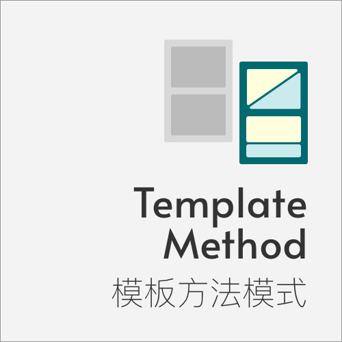
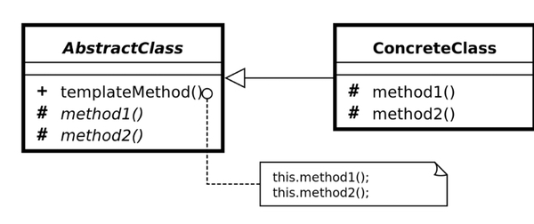

Template Method 模板方法模式
====

### 定义 
一个方法中定义一个算法的骨架，将一些步骤延迟到子类中，使得子类可以不改变一个算法的结构下重新定义该算法的某些特定步骤
   

> 对白: 又开始了相似的一天了啊。虽然是相似的一天，是完全不同的一天。《西瓜》

### 解决的问题

当冗余代码太多，扩展不方便的情况下，需要一个父类把相似的类整合（抽取）起来，实现代码复用    

### 场景

* 一次性实现算法的不变部分，将可变部分留到子类实现  
* 需要控制子类扩展的情况   

### 优点

* 提高代码复用性
* 提高拓展性
* 实现了反向控制

### 缺点

* 类个数增加

### 提示

* 策略模式和模板方法都是用于封装算法，前者组合，后者继承

### 类图

### 参考链接

> https://www.runoob.com/design-pattern/template-pattern.html    
> https://blog.csdn.net/carson_ho/article/details/54910518

    

 

