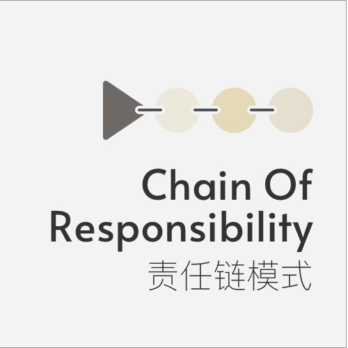

Chain-of-responsibility 责任链模式
====

### 定义 

为请求创建了一个接收者对象的链

   

> 对白: 

### 解决的问题

避免请求发送者与接收者耦合在一起，让多个对象都有可能接收请求，将这些对象连接成一条链，并且沿着这条链传递请求，直到有对象处理它为止

### 场景

1. 程序需要按顺序执行多个处理，例如包含多个if else的条件判断
2. 有多个对象可以处理同一个请求，具体哪个对象处理该请求由运行时刻自动确定

### 优点

1. 降低耦合度，将请求的发送者和接收者解耦
2. 增加程序灵活性，符合单一职责原则和开闭原则

### 缺点

1. 不能保证请求一定被接收

### 提示

### 类图

### 参考链接

https://refactoringguru.cn/design-patterns/book     
https://www.runoob.com/design-pattern/chain-of-responsibility-pattern.html

    

 

