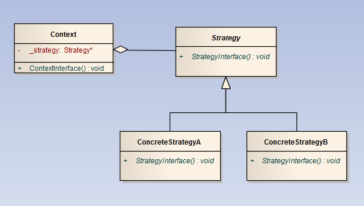

Strategy 策略模式
====

> 经典对白：我呢条命叫做“一将功成万骨枯”，不过我唔同意，我认为我哋出嚟行嘅，係生係死应该由自己决定，
>你哋跟咗我嘅日子最短，身家最清白，条路点行，就由你哋自己决定。 《无间道》

### 定义    

1. 定义了一组算法（根据业务规则）
2. 分别封装
3. 算法之间可以相互替换

### 解决的问题

当存在多种相似算法的情况下，需要多个if...else或者switch去处理问题，导致了系统复杂和代码难以维护

### 场景

* 优惠券业务逻辑或者会员促销
* 根据时间或者预算计划旅游的出行工具和住宿

### 优点

* 算法自由切换
* 容易扩展，直接新增一族算法类
* 避免多重条件判断

### 缺点

* 所有策略类需要对外暴露，上层模块才清楚如何选择
* 决策类数量多，不可复用

### 提示

如果一个模块的策略太多，需要考虑使用混合模式，解决策略类膨胀的问题

### 类图

### 文章参考

    

 

