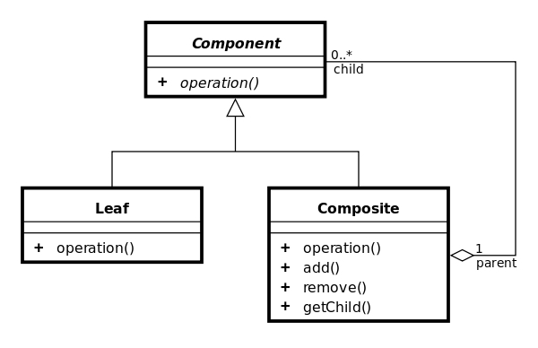

Composite 组合模式
====

### 定义    

将对象组合成树形结构来表现"整体/部分"层次结构，使用户对单个对象和组合对象的使用具有一致性。

> 对白：一直以为我跟何宝荣不一样，原来寂寞的时候，所有的人都一样。《春光乍泄》

### 解决的问题

针对树形结构的问题，模糊了简单元素和复杂元素的概念，简化了两者的操作，从而是客户程序与复杂元素的内部结构解耦

### 场景

* 树形菜单
* 文件系统

### 优点

1. 高层模块调用简单
2. 节点自由增加

### 缺点

1. 违反了依赖倒置原则：叶子和树枝都是实现类
2. 牺牲单一责任原则换取透明性（管理子节点和执行节点操作）

### 提示

一般情况迭代器模式和组合模式会结合使用

### 类图

### 参考链接

https://www.runoob.com/design-pattern/composite-pattern.html    

    

 

