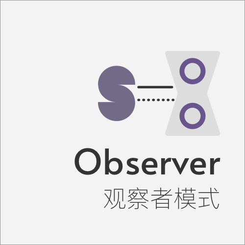

Observer 观察者模式
====

### 定义    

定义对象间的一对多依赖关系，当一个对象状态改变时,所有依赖于它的对象都会收到通知并自动更新

> 对白：不要回答！不要回答！不要回答！《三体》

### 解决的问题

对于一个对象改变状态需要通知其他对象是，需要保证高度的协作，同时兼顾低耦合和易用

### 场景

* ajax异步请求的成功回调
* DOM的事件绑定

### 优点

* 观察者（Observer）与被观察者（Subject）是抽象耦合
* 建立一套触发机制，容易扩展

### 缺点

* 通知太多观察者会耗费一定的时间
* 两者之间有循环依赖的话，会导致系统崩溃
* 观察者不能了解目标如何发生变化

### 提示

### 类图

### 参考链接

> https://www.runoob.com/design-pattern/observer-pattern.html   
> https://juejin.im/post/6844903556714070024    
> https://juejin.im/post/6844903858850758670 Vue响应式原理   
> https://juejin.im/post/6844903556714070024 《从vue源码看观察者模式》 
> https://juejin.im/post/6844903710410162183 《ES6 系列之 defineProperty 与 proxy》   
> https://juejin.im/post/6844903601416978439    

    

 

