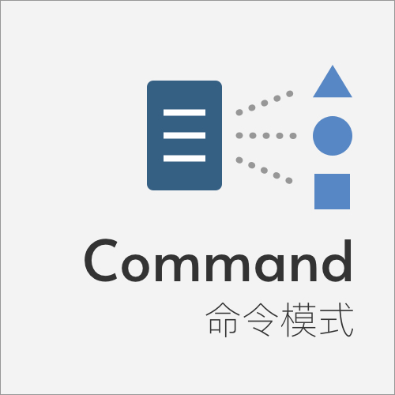
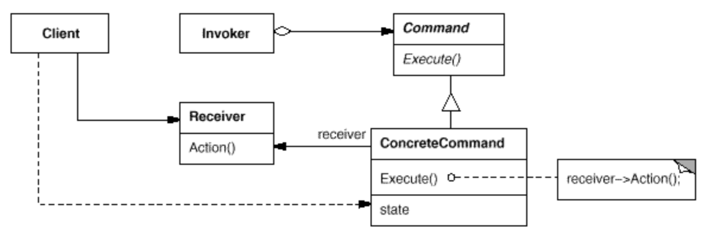

Command 命令模式
====

### 定义 

将一个请求封装成一个对象，以便使用不同的请求来参数化其他对象   

> 对白：精神啲！临时演员都系演员嚟。而家唔系拍紧鬼片，虽然你哋系饰演路人甲乙丙丁，但系一样系有生命，有灵魂嘅，尤其系我哋今次有机会同动作影后杜娟儿同台演出，应该好好 地珍惜呢个机会。畀啲精神好唔好？Action！ 《喜剧之王》  

### 解决的问题

解决行为请求者与行为实现者存在紧耦合的关系

### 场景

* 游戏或者文本编辑、绘图的撤销/重做功能
* 快捷键、宏命令

### 优点

* 降低系统耦合度，达到模块的解耦和时间上的解耦
* 系统容易扩展，只需添加新的命令

### 缺点

* 类或者功能的膨胀：添加一个功能就得增加多一个命令类别

### 提示

* js可以通过高阶函数方便地使用命令模式
* 命令模式再js中是一种隐形的模式

### 类图

### 参考链接

> https://notfalse.net/4/command-pattern        
> https://www.runoob.com/design-pattern/command-pattern.html    

    

 

