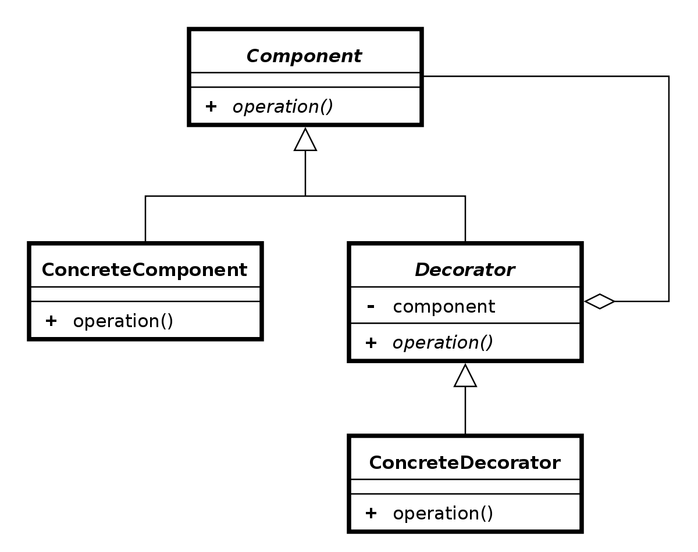

Decorator 装饰者模式
====

### 定义 

动态地给对象添加额外的职责或者行为，相比于继承更加灵活
   

> 对白:  You wear a mask for so long, you forget who you were beneath it. 《V字仇杀队》

### 解决的问题

为了适应业务扩展，经常要增加功能或者添加子类，使用装饰者模式可以灵活的增加功能

### 场景

* 系统的埋点和数据上报
* 表单增加字段，需要新增验证的条件

### 优点

* 需要扩展函数时，不会增加耦合度

### 缺点

* 多层的嵌套会影响性能和增加复杂度

### 提示

### 类图

### 参考链接

> https://www.runoob.com/design-pattern/decorator-pattern.html      
>

    

 

