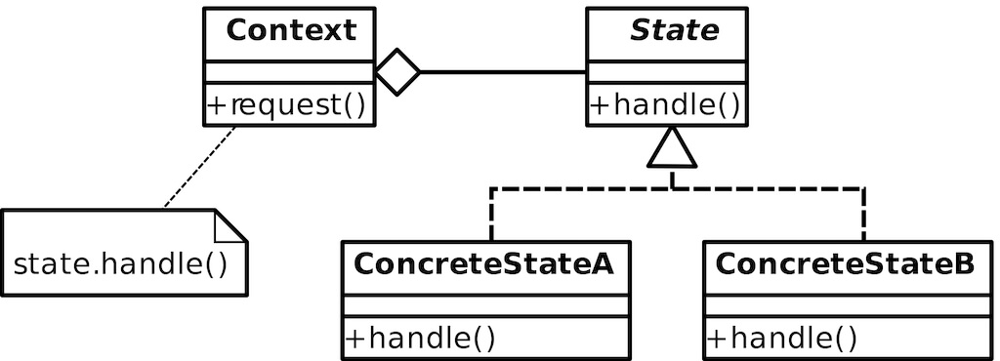

State 状态模式
====

### 定义 

允许对象在内部状态改变时改变它的行为，对象看起来好像修改了它的类
   

> 对白: 千回百转，一悲一喜 《一代宗师》

### 解决的问题

当代码中包含大量与对象状态有关的条件语句

### 场景

1. 表单的switch切换开关，音乐播放器UI
2. 订单状态切换 

### 优点

1. 把状态有关的封装到一个类中，方便添加新的状态
2. 用对象代替单独的状态变量来记录当前状态，状态切换更加直观
3. 避免Context因为大量的条件分支而代码膨胀，状态类与Context分离
4. 状态类可以被多个Context实例共享

### 缺点

1. 需要定义多个状态类，增加了对象和类的个数
2. 对'开闭'原则支持不太好，新增的状态有可能需要修改其他状态类的负责状态转换的部分代码

### 提示

需要区分策略模式和状态模式

### 类图

### 参考链接

https://www.runoob.com/design-pattern/state-pattern.html

    

 

