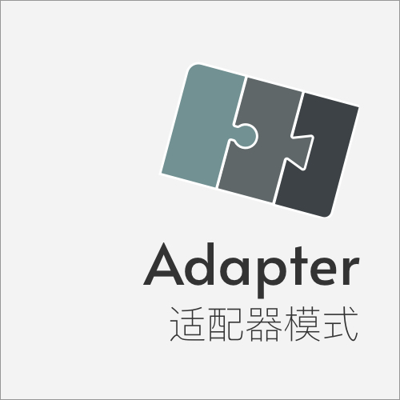
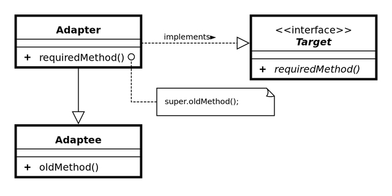

State 状态模式
====

### 定义 

将一个类的接口装换成客户期望的另外一个接口适配器让原本接口不兼容的类可以合作无间
   

> 对白: 

### 解决的问题

迭代开发过程中，由于现在的类不能直接用于新的环境中，需要解决之间的兼容问题

### 场景

1. 前端兼容后端返回的一个对象，其方法或属性不符合要求
2. 创建可复用的一个对象，它可以与其他不相关的对象协同工作

### 优点

* 提高类的复用性
* 增加灵活性

### 缺点

* 过多的适配器会让系统变乱

### 提示

* 适配器模式可分3类：类适配、对象适配、接口适配
* 区分装饰者模式与适配器模式的区别
* 通常不会在前期设计阶段时添加，而是解决后期项目迭代问题时

### 类图

### 参考链接

> https://www.runoob.com/design-pattern/adapter-pattern.html    
>

    

 

